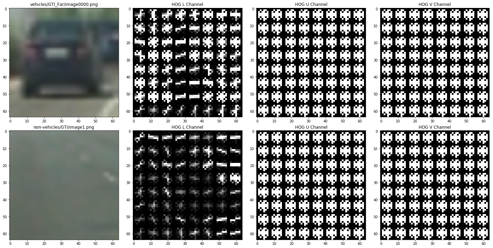

# Vehicle Detection Project

The goal of this project is to detect vehicles on the road from the
camera equipped to the car.

Steps:

* Feature extraction on car/ non-car images data set.
  Used following extraction and combined/ normalized with standard deviation.
  * Histogram of Oriented Gradients (HOG).
  * Raw image (re-sized to 32 x 32 and flatten).
  * Color histogram.

* Implement a sliding-window and use your trained classifier to search for vehicles in images.

* Run the pipeline on a video stream and create a heat map of detection.
  Explore the window size and choose reliable detection by adjusting the threshold.

* Estimate a bounding box for vehicles detected and draw on the frame.

## [Rubric](https://review.udacity.com/#!/rubrics/513/view) Points

### Histogram of Oriented Gradients (HOG)

#### 1. Explain how (and identify where in your code) you extracted HOG features from the images.

Used `skimage.feature.hog` and calculate HOG for each color channels.
The code is in the section `HOG visualization` in the notebook [VehicleDetection.ipynb](./VehicleDetection.ipynb).

#### 2. Explain how you settled on your final choice of HOG parameters.

Comparison with color spaces (RGB vs LUV) and channels used.

Randomly split the test set for 20% of images.

| color space | orient | pixel per cell | cell per block | channel | test accuracy |
| ----------- | ------ | -------------- | -------------- | ------- | ------------- |
| RGB         | 9      | 8              | 2              | 0       | 0.9386        |
| RGB         | 9      | 8              | 2              | ALL     | 0.9682        |
| LUV         | 9      | 8              | 2              | ALL     | 0.9851        |

I chose LUV and uses all channel.
There's bunch of other combinations I could test.
However, by combining HOG, raw images (resized and flatten) and
color histogram with standard
normalization, I got more than 99% accuracy at all times.
Since testing combination is time consuming task,
Decided to review the farther optimization if I faced accuracy issue
on detecting cars on the frame.

#### 3. Describe how (and identify where in your code) you trained a classifier using your selected features

- Read training data
- Extract features (HOG, raw image, color histogram)
- Combine each features and normalize with Standard Normalizer.
- Split the training data and test data randomly. 20% is used for test data.

The code is in [VehicleDetection.ipynb](./VehicleDetection.ipynb)
section `Train SVM classifier`

### Sliding Window Search

#### 1. Describe how (and identify where in your code) you implemented a sliding window search.

**How did you decide what scales to search and how much to overlap windows?**

[sliding-window1]: ./output_images/sliding-window-search1.png
[sliding-window2]: ./output_images/sliding-window-search2.png

I tried with the following search windows:
(Instead of using overlap percentage, used how many cells to step.)

| scale | step    | y start | y stop |
| ----- | ------- | ------- | ------ |
| 1     | 1       | 400     | 500    |
| 1.5   | 1       | 400     | 600    |
| 0.5   | 1       | 400     | 450    |

![sliding-window1]

Looks good. It seems the search with the scale 0.5 can be skipped.

To reduce the steps, I tried with the same parameters other than step = 2.

![sliding-window2]

Not so bad. However, result using step for the width of cell (8 pixel) would be more reliable since we can use higher threshold of detected number to drop false positives.

I didn't tuned the classifier here.
There's false positie though, I have implemented outlier rejection mentioned in [Video Implementation](#video-implementation) section.

Final parameters for window search I chose:

| scale | step    | y start | y stop |
| ----- | ------- | ------- | ------ |
| 1     | 1       | 400     | 500    |
| 1.5   | 1       | 400     | 600    |

### Video Implementation

#### 1. Provide a link to your final video output.

Here's a [link to my video result](./output_images/output.mp4)

#### 2. Describe how (and identify where in your code) you implemented filter for false positives and method for combining overlapping bounding boxes.

Heatmap:

- Iterate over the boundary box detected by the window search and +1 for the coordinates surrunded by the boundary box.

Thresh holding:

- Applied threshold for the heatmap. I chose 3 which means area surrounded by the bounding box less than or equal to 3 times would be zeroing.

Determine the new bounding box:

- Use `scipy.ndimage.measurements.label` to extract continuous region in the thresholded heatmap.

- Determine the new bounding box by using corner coordinates of the area found by `scipy.ndimage.measurements.label` function.

Here's heatmap and new bounding box determined by the process above.

[heatmap]: ./output_images/heatmap.png

![heatmap]

The code is in the section `Deal with Multiple Detections & False Positives` in the notebook [VehicleDetection.ipynb](./VehicleDetection.ipynb)

---

### Discussion

#### 1. Briefly discuss any problems / issues you faced in your implementation of this project.

**Where will your pipeline likely fail?  What could you do to make it more robust?**

##### Not enough training set for the real products.
  - Different colors of car.
  - Different type of cars such as lorries.
  - Different kind of weather condition.

Improvements:

- Augumenting the training data.

##### Car Directions

In the project video, focused on cars running in same direction.
Since the opposite direction lane is in the far left.
But in the real situation, we may need to detect cars in same direction and opposite directions and manage them separately.

Possible improvements:

- Classify training data into 3 labels. car same direction, car opposite direction, non-cars

- Track the detected car bounding box size and see the size is decreasing, increasing, not changing.

